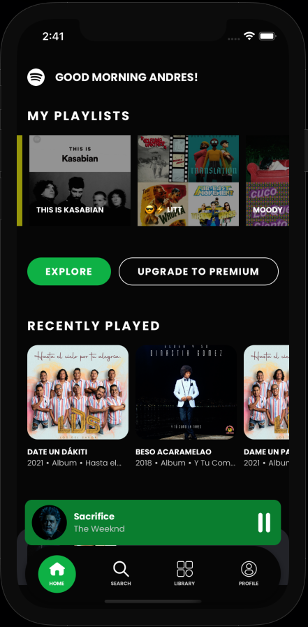
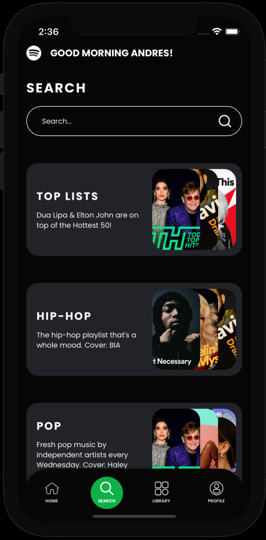
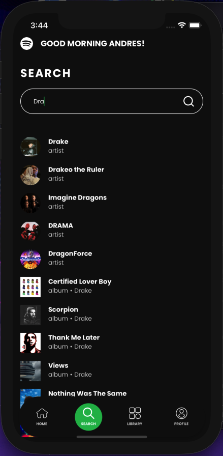
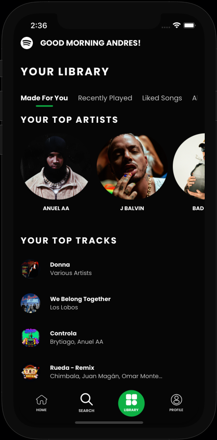
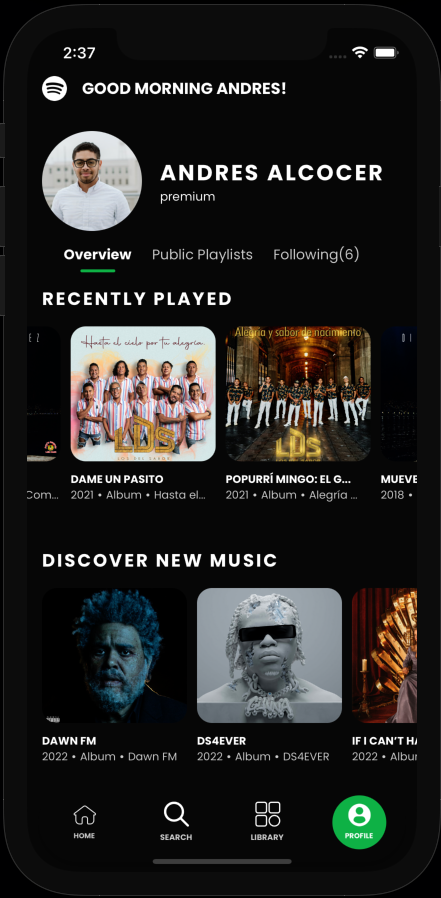
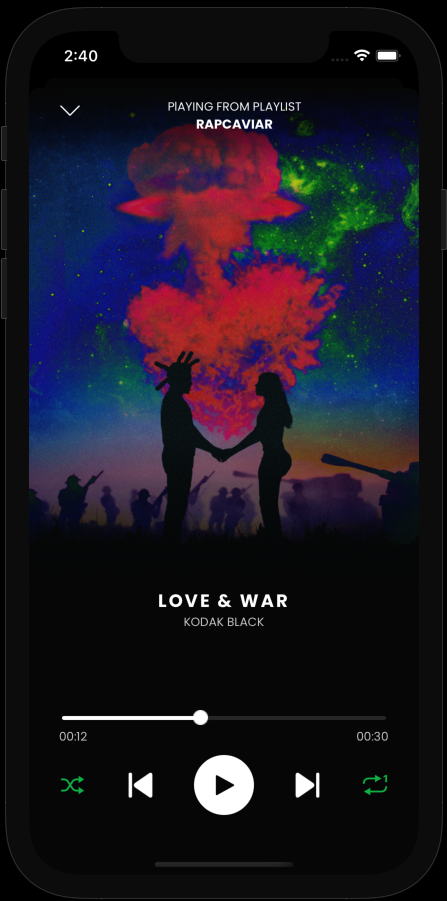
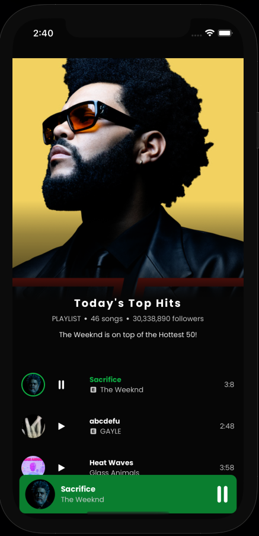

# React Native Spotify Clone Redesigned

Complete source code for the YouTube tutorial React Native Spotify Clone Redesigned. The design used was created by Heba Zatar, you can find it [here](https://www.behance.net/gallery/110213585/SPOTIFY-REDESIGN-UIUX-DESIGN-FREE?tracking_source=).

This project uses the Spotify API. You will need to create a Spotify account to get a Client ID and Client Secret [here](https://developer.spotify.com/dashboard/). You will also need to install the React Native development environment as per docs [here](https://reactnative.dev/docs/0.65/environment-setup).

<!--    
   -->

  

- Clone repo locally: `git clone https://github.com/AndresXI/RN-Spotify-Clone-Redesigned.git`

### Running the server locally

- Cd into api folder: `cd ./api`
- Install dependencies: `npm install`
- create .env file with ENV variables:
  - `CLIENT_ID=<YOUR_CLIENT_ID_HERE>`
  - `CLIENT_SECRET=<YOUR_CLIENT_SECRET_HERE>`
  - `REDIRECT_URL=<YOUR_REDIRECT_URL_HERE>`
  - Start server: `npm start`

### Running the app

- Add .env file in root directory with ENV variables:
  - `CLIENT_ID=<YOUR_CLIENT_ID_HERE>`
  - `REDIRECT_URL=<YOUR_REDIRECT_URL_HERE>`
  - `BASE_URL=https://api.spotify.com/v1`
- Install dependencies: `npm install`
- Install Pods: `cd ./ios && pod install`
- Run Metro bundler: `npx react-native start`
- Running in IOS: `npx react-native run-ios`
- Running in Android: `npx react-native run-android`
